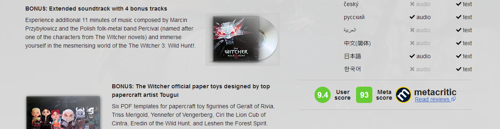

# Metacritic score for GOG

## Description

The sript adds metacritic score to GOG game's page

- **NOTE**: In case when the script gets nothing from metacritic.com then the script won't add anything to the GOG game's page.

## How to install the script

1. Install userscript extension for your browser - [Violentmonkey](https://violentmonkey.github.io/get-it/), [Greasemonkey](https://addons.mozilla.org/en-US/firefox/addon/greasemonkey/) or [Tampermonkey](https://tampermonkey.net/).
2. Go to script [page](https://greasyfork.org/en/scripts/381605-metacritic-score-for-gog) and press INSTALL button.

## License

GPLv3