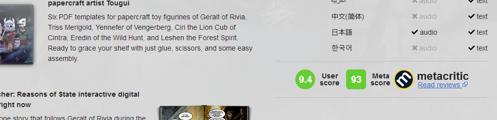

# Script name

GOG Metacritic Score

## Script description

The sript adds metacritic score to GOG game's page

## How to install the script

1. Install userscript extension for your browser - [Violentmonkey](https://violentmonkey.github.io/get-it/), [Greasemonkey](https://addons.mozilla.org/en-US/firefox/addon/greasemonkey/) or [Tampermonkey](https://tampermonkey.net/).
2. For greasyfork site: Go to script [page]( ADD LINK TO YOUR SCRIPT HERE ! ) and press INSTALL button.

## License

GPLv3